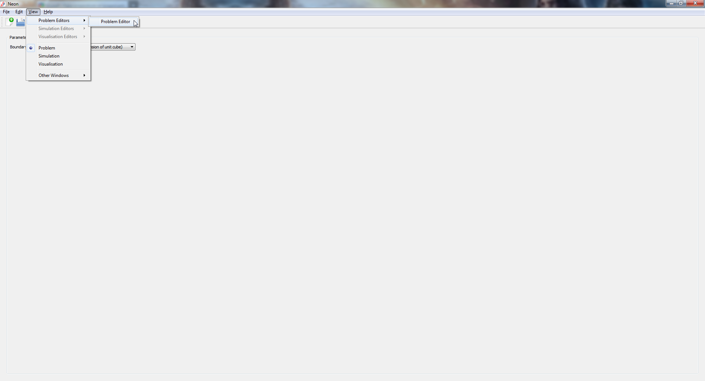

.. _using-opencmiss:

***************
Using OpenCMISS
***************

.. toctree::
   :maxdepth: 2

This lab will make use of the `OpenCMISS <http://opencmiss.org/>`_ computational modelling software being developed at the Auckland Bioengineering Institute. This software includes a computational back-end named iron that performs simulations, and a font-end gui named Neon that is used to run the simulations and visualise the results. For the purpose of these labs, we will only be interacting with the Neon gui that has been setup with a series of simple computational models to help guide you through stress and strain analysis of isotropic and anisotropic materials.

.. _starting-neon:

=============
Starting Neon
=============
Neon can be run from the start menu. When the program starts, you will be prompted to select a lab as shown in the screenshots below.

.. image:: images/selecting_a_lab.png

Once a lab has been selected and you have clicked "ok", a drop down menu will appear listing a series of models that will be analysed during the course of the lab.

.. image:: images/model_drop_down_menu.png

.. _running-models-in-Neon:

======================
Running models in Neon
======================

To run a model in a lab, select the model from the drop down menu described in the preivious section, and click "Run". If at any time, the run button is not visible, click View->Problem Editors->Problem Editor to make the button visible, as shown in the following screenshots.

.. image:: images/running_models.png
