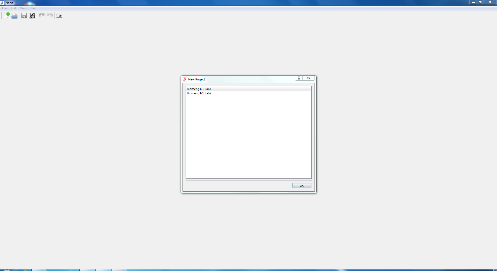
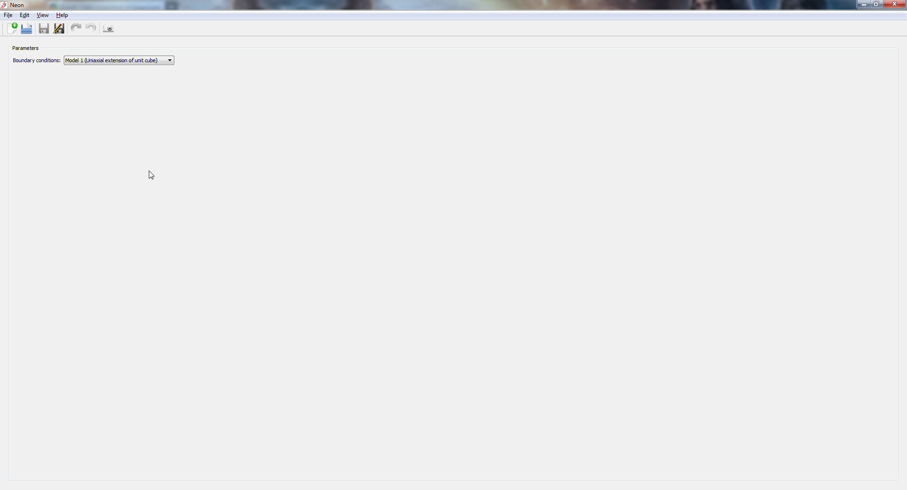

.. _using-OpenCMISS:

***************
Using OpenCMISS
***************

.. toctree::
   :maxdepth: 2

This lab will make use of the `OpenCMISS <http://opencmiss.org/>`_ computational modelling software being developed at the `Auckland Bioengineering Institute <http://www.abi.auckland.ac.nz/en.html>`_. This software includes a computational back-end named Iron that runs simulations, and a font-end graphical user interface (GUI) named Neon that is used to visualise the results. For the purpose of these labs, we will only be interacting with the Neon GUI that has been set up with a series of simple computational models for analysing stresses and strains in isotropic and anisotropic materials.

.. _installing-OpenCMISS:

====================
Installing OpenCMISS
====================

An OpenCMISS installer for Windows 7 (64-bit) can be downloaded from this `link <https://github.com/OpenCMISS-Examples/soft-tissue-mechanics-labs/releases/download/v1.0/OpenCMISS-0.2.0.exe>`_.

.. _starting-OpenCMISS:

==================
Starting OpenCMISS
==================

Once installed, OpenCMISS can be run from the start menu. When the program starts, you will be prompted to select a lab as shown in the screenshot below.

Select a lab and click ok. 

Click View->Problem and a drop down menu will appear listing a series of models that will be analysed during the course of the lab.

.. _running-models-in-OpenCMISS:

===========================
Running models in OpenCMISS
===========================

Select a model from the drop down menu and click "Run". 

.. note::

    If at any time, the run button is not visible, click View->Problem Editors->Problem Editor to make the button visible, as shown in the following screenshots.

      .. image:: images/problem_editor.png

      .. image:: images/running_models.png

